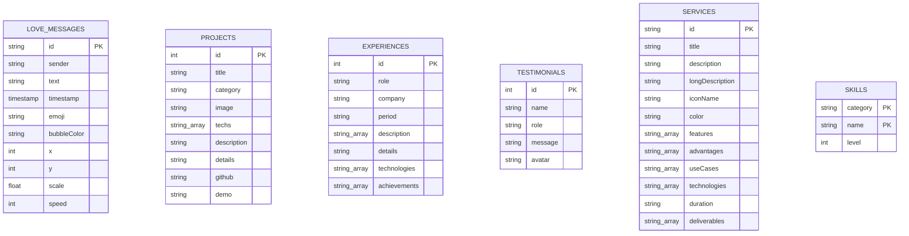

# Schéma Complet de la Base de Données

Ce document présente l'architecture et le schéma complet de la base de données pour l'application **Dev & Data Portfolio 3** de Dels Dinla. 

L'application utilise actuellement un stockage hybride :
1. **Persistance dynamique (Serveur) :** Un fichier plat atomique `messages.json` géré côté serveur Express agissant comme un stockage NoSQL ultra-rapide pour les expressions du mur d'amour.
2. **Données statiques de présentation :** Des collections de données structurées de manière relationnelle au sein de `src/data/mockData.ts` (Projets, Expériences, Services, Témoignages, Compétences).

En cas de migration vers une base de données relationnelle comme **PostgreSQL (Cloud SQL)** ou NoSQL comme **Firestore (Firebase)**, ce document sert de schéma directeur d'implémentation.

---

## 🗺️ Diagramme Relationnel Conceptuel (Mermaid)



---

## 🗄️ 1. Table des Données Dynamiques (Persistées)

### Table : `love_messages` (Mur d'Amour)
Cette table stocke les bulles d'amour interactives envoyées en temps réel par les utilisateurs via l'API Express `/api/messages`.

| Colonne | Type SQL | Équivalent NoSQL | Contraintes | Description |
| :--- | :--- | :--- | :--- | :--- |
| **`id`** | `VARCHAR(50)` | `String` | `PRIMARY KEY` | Identifiant unique généré à l'envoi (`msg_` + timestamp + random). |
| **`sender`** | `VARCHAR(30)` | `String` | `NOT NULL` | Surnom saisi par l'expéditeur (ex: Mike Gouthon, Dels). |
| **`text`** | `VARCHAR(200)` | `String` | `NOT NULL` | Message d'amour ou mot doux d'une longueur max de 180-200 caractères. |
| **`timestamp`** | `BIGINT` | `Number` | `NOT NULL` | Date et heure de soumission au format Epoch millisecondes. |
| **`emoji`** | `VARCHAR(8)` | `String` | `DEFAULT '💖'` | Caractère Émoji d'ambiance ou de symbole romantique choisi. |
| **`bubbleColor`** | `TEXT` | `String` | `NOT NULL` | Classes CSS Tailwind de dégradé appliquées au rendu visuel. |
| **`x`** | `INT` | `Number` | `CHECK (x BETWEEN 0 AND 100)` | Positionnement X en pourcentage pour la flottaison à l'écran. |
| **`y`** | `INT` | `Number` | `CHECK (y BETWEEN 0 AND 100)` | Positionnement Y en pourcentage pour la flottaison à l'écran. |
| **`scale`** | `FLOAT` | `Number` | `CHECK (scale > 0)` | Échelle d'affichage visuel aléatoire de la bulle (ex: 0.9 à 1.15). |
| **`speed`** | `INT` | `Number` | `CHECK (speed > 0)` | Durée du cycle d'animation flottante (vague de dérive en secondes). |

#### Exemple d'enregistrement JSON :
```json
{
  "id": "msg_1718132454123_485",
  "sender": "Mike Gouthon",
  "text": "Ton compilateur d'amour tourne à 100% sans aucun bug ! 💻✨",
  "timestamp": 1718132454123,
  "emoji": "💻",
  "bubbleColor": "from-rose-500/15 via-rose-500/10 to-purple-500/5 text-rose-600 dark:text-rose-400 border-rose-200/50 dark:border-rose-900/40 shadow-rose-500/5",
  "x": 68,
  "y: ": 35,
  "scale": 0.95,
  "speed": 25
}
```

---

## 📊 2. Tables de Présentation Structurées (Statiques)

### Table : `projects` (Projets du Portfolio)
Gère le catalogue de réalisations professionnelles et académiques de Dels Dinla.

| Colonne | Type SQL | Équivalent NoSQL | Contraintes | Description |
| :--- | :--- | :--- | :--- | :--- |
| **`id`** | `SERIAL` | `Number` | `PRIMARY KEY` | Clé primaire auto-incrémentée. |
| **`title`** | `VARCHAR(100)` | `String` | `NOT NULL` | Titre du projet interactif. |
| **`category`** | `VARCHAR(20)` | `String` | `CHECK (value IN ('Dev', 'Data', 'Autres'))` | Catégorie thématique de la réalisation. |
| **`image`** | `VARCHAR(255)` | `String` | `NOT NULL` | Lien/URL absolue ou relative de l'image de couverture. |
| **`techs`** | `TEXT[]` | `Array<String>` | `NOT NULL` | Liste ordonnée des technologies vedettes utilisées (ex: `['React', 'Python', 'FastAPI']`). |
| **`description`** | `TEXT` | `String` | `NOT NULL` | Description liminaire du projet pour l'affichage miniature. |
| **`details`** | `TEXT` | `String` | `NOT NULL` | Présentation exhaustive et détaillée du projet pour la modal de zoom. |
| **`github`** | `VARCHAR(255)` | `String` | `DEFAULT '#'` | Lien direct vers le dépôt de code public. |
| **`demo`** | `VARCHAR(255)` | `String` | `DEFAULT '#'` | Lien direct vers la version de démonstration hébergée. |

---

### Table : `experiences` (Parcours & Formation)
Enregistre la chronologie des postes, stages, et diplômes du Data Scientist.

| Colonne | Type SQL | Équivalent NoSQL | Contraintes | Description |
| :--- | :--- | :--- | :--- | :--- |
| **`id`** | `SERIAL` | `Number` | `PRIMARY KEY` | Clé primaire auto-incrémentée. |
| **`role`** | `VARCHAR(100)` | `String` | `NOT NULL` | Intitulé exact du poste ou du diplôme (ex: Data Scientist Senior). |
| **`company`** | `VARCHAR(100)` | `String` | `NOT NULL` | Nom de l'établissement ou entreprise d'accueil. |
| **`period`** | `VARCHAR(30)` | `String` | `NOT NULL` | Période chronologique d'exercice (ex: "2021 - Présent"). |
| **`description`** | `TEXT[]` | `Array<String>` | `NOT NULL` | Puces d'explications rapides et synthétiques du rôle en production. |
| **`details`** | `TEXT` | `String` | `NOT NULL` | Description détaillée du quotidien et des responsabilités. |
| **`technologies`** | `TEXT[]` | `Array<String>` | `NOT NULL` | Suite technique maîtrisée au cours de cette mission. |
| **`achievements`** | `TEXT[]` | `Array<String>` | `NOT NULL` | Réussites concrètes chiffrées liées au poste (ex: "+15% de CA"). |

---

### Table : `services` (Catalogue de Services)
Définit la plaquette des services spécialisés que Dels propose en freelance ou collaboration.

| Colonne | Type SQL | Équivalent NoSQL | Contraintes | Description |
| :--- | :--- | :--- | :--- | :--- |
| **`id`** | `VARCHAR(50)` | `String` | `PRIMARY KEY` | Identifiant interne textuel (ex : `analytics`, `ml`, `data-engineering`). |
| **`title`** | `VARCHAR(100)` | `String` | `NOT NULL` | Dénomination commerciale de la prestation. |
| **`description`** | `TEXT` | `String` | `NOT NULL` | Accroche marketing synthétique pour les cartes d'accueil. |
| **`longDescription`** | `TEXT` | `String` | `NOT NULL` | Description textuelle approfondie de l'expertise métier mise en jeu. |
| **`iconName`** | `VARCHAR(30)` | `String` | `NOT NULL` | Clé de l'icône de représentation (ex: `chart`, `brain`, `database`). |
| **`color`** | `VARCHAR(100)` | `String` | `NOT NULL` | Classes Tailwind définissant le thème coloriel de la carte. |
| **`features`** | `TEXT[]` | `Array<String>` | `NOT NULL` | Fonctionnalités clés incluses dans la prestation. |
| **`advantages`** | `TEXT[]` | `Array<String>` | `NOT NULL` | Bénéfices directs pour le client. |
| **`useCases`** | `TEXT[]` | `Array<String>` | `NOT NULL` | Cas d'usages réels traités (ex: "Prédiction de churn"). |
| **`technologies`** | `TEXT[]` | `Array<String>` | `NOT NULL` | Boîte à outils logicielle mise en action. |
| **`duration`** | `VARCHAR(30)` | `String` | `NOT NULL` | Délai indicatif moyen de réalisation (ex: "4-8 semaines"). |
| **`deliverables`** | `TEXT[]` | `Array<String>` | `NOT NULL` | Liste des livrables tangibles remis à l'issue de la mission. |

---

### Table : `testimonials` (Témoignages Clients)
Retours d'expérience et recommandations d'anciens collaborateurs.

| Colonne | Type SQL | Équivalent NoSQL | Contraintes | Description |
| :--- | :--- | :--- | :--- | :--- |
| **`id`** | `SERIAL` | `Number` | `PRIMARY KEY` | Clé primaire auto-incrémentée. |
| **`name`** | `VARCHAR(105)` | `String` | `NOT NULL` | Prénom et Nom du recommandeur. |
| **`role`** | `VARCHAR(100)` | `String` | `NOT NULL` | Poste occupé au moment de la recommandation (ex: "CTO, Tech Innovators"). |
| **`message`** | `TEXT` | `String` | `NOT NULL` | Contenu de l'avis rédigé. |
| **`avatar`** | `VARCHAR(255)` | `String` | `NOT NULL` | Lien/URL vers l'image de profil de l'auteur. |

---

### Table : `skills` (Matrice des Bulles de Compétences)
Niveaux d'aptitude sur les différents segments d'intervention.

| Colonne | Type SQL | Équivalent NoSQL | Contraintes | Description |
| :--- | :--- | :--- | :--- | :--- |
| **`category`** | `VARCHAR(30)` | `String` | `PRIMARY KEY (Partie 1)` | Groupe de discipline (`development` \| `dataScience` \| `autres`). |
| **`name`** | `VARCHAR(50)` | `String` | `PRIMARY KEY (Partie 2)` | Intitulé de la technologie ou concept (ex: Python, Pandas, React). |
| **`level`** | `INT` | `Number` | `CHECK (level BETWEEN 0 AND 100)` | Jauge d'expertise quantifiée en pourcentage. |

---

## 🤖 3. Modèles de Données Transitoires (Payloads d'API)

### Structure de l'historique d'un Chat (`/api/chat`)
Utilisé par le module **AgentChatModal** pour structurer l'historique conversationnel avec Gemini :

```ts
interface ChatMessage {
  role: 'user' | 'assistant'; // Mappé côté serveur vers 'user' ou 'model'
  content: string;             // Contenu textuel du message
}
```

### Format du Code Romantique compilé (`/api/romantic-code`)
Retourné par l'assistant IA romantique au client de l'application :

```json
{
  "code": "/* Code d'attraction gravitationnelle */",
  "commentary": "Remarque poétique en français sur les performances émotionnelles de cette boucle d'affection."
}
```

### Schéma d'Activity Git groundé (`/api/project-updates`)
Entrée structurée d'activité de mise à jour pour le pipeline Git de Dels :

```json
{
  "commitHash": "a1b2c3d",
  "author": "Dels Dinla",
  "date": "Il y a 3 heures",
  "message": "Optimisation du temps de clustering K-Means",
  "category": "feature",
  "details": "Réduction de 40% des calculs de distance en introduisant de l'indexation KD-Tree dans la bibliothèque numpy."
}
```
